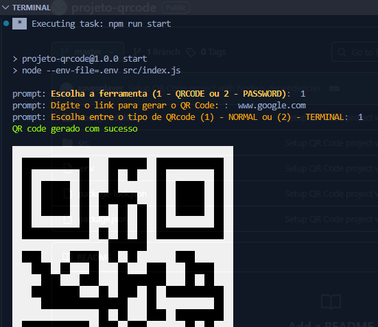

# 🚀 QR Code & Password Generator


Kit de utilidades desenvolvido em **Node.js** para geração de **QR Codes** e **senhas aleatórias** através do terminal.

O projeto foi desenvolvido como desafio prático da **Digital Innovation One (DIO)** com foco em modularização, gerenciamento de dependências e organização de aplicações Node.js.

---

## 📖 Sobre o Projeto

A aplicação oferece um menu interativo no terminal que permite ao usuário escolher entre diferentes ferramentas utilitárias.

Atualmente estão disponíveis:

* Geração de QR Codes a partir de textos ou URLs;
* Geração de senhas aleatórias personalizadas.

A estrutura foi organizada para facilitar a manutenção e permitir a adição de novas funcionalidades futuramente.

---

## 🛠️ Tecnologias Utilizadas

* Node.js
* JavaScript
* NPM
* Dotenv
* Prompt
* QRCode

---

## 🏗️ Arquitetura

O projeto foi dividido por responsabilidades para manter o código organizado e de fácil manutenção.

* **prompts-schema**: definição dos fluxos de interação com o usuário;
* **services**: implementação das regras de negócio;
* **utils**: recursos auxiliares reutilizáveis;
* **index.js**: ponto de entrada da aplicação.

---

## 📂 Estrutura do Projeto

```text
projeto-qrcode/
│
├── assets/
│   └── demo-qrcode.png
│
├── src/
│   ├── prompts-schema/
│   ├── services/
│   │   ├── password/
│   │   └── qr-code/
│   └── index.js
│
├── .env
├── package.json
├── package-lock.json
└── README.md
```

---

## ⚙️ Instalação

Clone o repositório:

```bash
git clone https://github.com/xavesplayer/projeto-qrcode.git
```

Acesse a pasta do projeto:

```bash
cd projeto-qrcode
```

Instale as dependências:

```bash
npm install
```

---

## ▶️ Executando o Projeto

```bash
npm start
```

ou

```bash
node --env-file=.env src/index.js
```

---

## 📸 Demonstração

### Gerando um QR Code pelo terminal

O usuário seleciona a funcionalidade desejada, informa o conteúdo que será convertido e escolhe o formato de saída.



---

## 🎯 Conceitos Praticados

Durante o desenvolvimento deste projeto foram aplicados conceitos como:

* Modularização de aplicações Node.js;
* Organização de código por responsabilidades;
* Utilização de bibliotecas externas;
* Gerenciamento de dependências;
* Manipulação de entrada de dados via terminal;
* Configuração de variáveis de ambiente;
* Estruturação de projetos escaláveis.

---

## 🔮 Melhorias Futuras

* Exportação do QR Code em formato PNG;
* Geração de QR Codes personalizados;
* Histórico de códigos gerados;
* Novos formatos de saída;
* Interface web utilizando React.

---

## 👨‍💻 Autor

**Jefferson Pereira Salvador**

Estudante de Engenharia de Software com foco em desenvolvimento backend, bancos de dados e construção de aplicações escaláveis.

---

Projeto desenvolvido para fins educacionais através da plataforma DIO.
